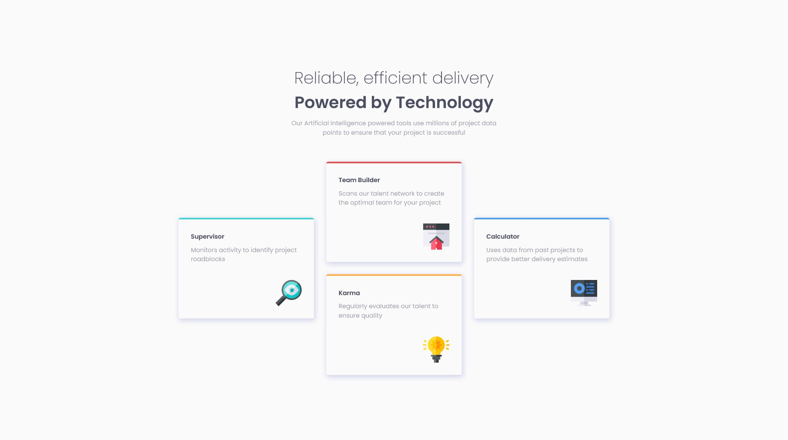

# Frontend Mentor - Four card feature section solution

This is a solution to the [Four card feature section challenge on Frontend Mentor](https://www.frontendmentor.io/challenges/four-card-feature-section-weK1eFYK). Frontend Mentor challenges help you improve your coding skills by building realistic projects. 

### Screenshot

### Links

- Solution URL: https://chen-yo.github.io/four-card-feature-section-master/
- Live Site URL: https://github.com/chen-yo/four-card-feature-section-master/

## My process

### Built with

- Semantic HTML5 markup
- CSS custom properties
- Flexbox
- Mobile-first workflow

## Author

- Frontend Mentor - [@chen-yo](https://www.frontendmentor.io/profile/chen-yo)
- Twitter - [@cyonati](https://twitter.com/cyonati)
